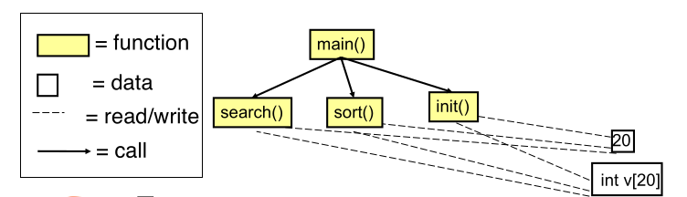
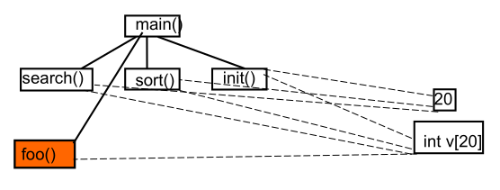
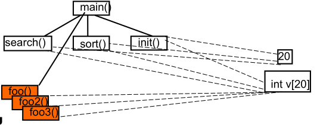
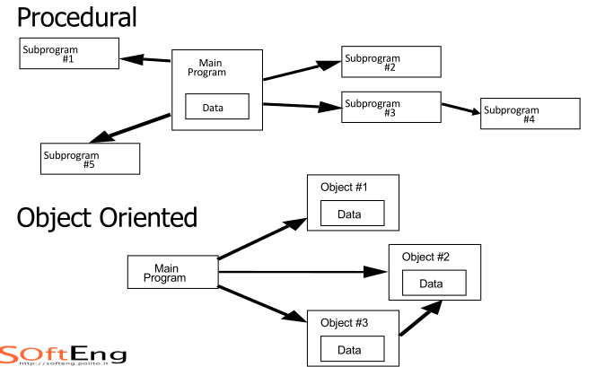

# OOP

it was there becaus

[toc]

## Infos
### Prof
- Fabrizio Lamberti
- Fabio Garcea

### Language
oop in java  
sw $\to$ Eclipse 21  
jvm $\to$ java 17

### Overview SE

Software $\neq$ Program

possible division:
- Safety critical
- Mission critical
- Others (like games)

  
# Object oriented programming

## Classes and Object


### Example using Basi di dati   
diagramma entità-relazioni


Codice tes  $\leftarrow$ Entità  
$\downarrow$
Medico|
---|  
$\downarrow$  
Nome Cognome $\leftarrow$ Attributi


CodTess|nome|cognome
---|---|---|--- 
1234|Alessio|Neri|--- 
---|---|---|--- 
---|---|---|--- 
---|---|---|--- 

righe $\to$ ditanza
dati veri


### Example using OOP   
Example|OOP Name|Meaning
:---:|:---:|:---:|  
Medico|Class|Name of the file/Structure
CodeTess, Nome, Cognome| Attributes| it describes the structure (data)
Functions|Procedures/methods| core of the Program (Operation/methods)

```C
int x;
```
$\downarrow$  
Reificazione (inverso di astrazione)

$\downarrow$  
Oggetto = istanza

```C
x = 5;
```

Classe solo struttura dei dati  
reificazioni $\to$ passo da classe a istanza

```C
  int r; //Global variable
//blocco
{
  int x; //scope
}
x = 5; //error

```
### Programmazione strutturata
costrutto selezione o scelta ```if```  
costrutto iterazione ```for(), while()```  

eccezione è prima dell'errore

```c
int vect[20];
void sort() { /* sort */ }
int search(int n){ /* search */ }
void init() { /* init */ }
// …
int i;
void main(){
  init();
  sort();
  search(13);
}
```
### Vector
- It is not possible to consider a vector
as a primitive and modular concept
- Data and functions cannot be
modularized properly  

## OOP usage

keeping together DATA and OPERATION on that data
- ENCAPSULATION
- INFORMATION HIDING

that's basically a stucture  
- MAIN is the interface, the Others functions are modules  
- modules can be reusable IT IS A CLASS
- boxes with data is called class

you can use OO to add some features w/out destroing part of the code


#### Differences


```java
int x;
Medico m;
m = new Medico();
```

int x;
x|
-|
x = 5; // operanzione di assegnamento
5|
-|

Medico|
-|
CodTess nome cognome|
Riceve() Opera()|

Variable declaration:
```m``` is the name of the object (it doesn't exist yet)
```java
Medico m;
m = new Medico();
```
I've created an OBJECT of a CLASS that is assigned to the variable ```m```
Medico has space in memory (That's everithing is been done)

in c it'll be
```c
typedef struct Medico_s *Medico_t;

struct Medico_s{
  char *Nome;
  char *Cognome;
  int *id;
};
```

```c
int main(){
  Medico_t *m;
}
```
```
Obviously you have to allocate everithing strdup in a list insertion
```
variablie

imagine a pointer m that points to *Medico
m|
-|
$\downarrow$
Medico|
-|
12345 Alessio Neri|
Riceve() Opera()|
istanza/oggetto di classe medico

```java
class Car {
string bodyColor;
void setBodyColor(…) {…}
void turnOn() {…}
}
Car mikeCar = new Car();
c.setBodyColor(red);
c.turnOn();
```
```java
class Vector {
  //data
  private int v[20];
  }
  //interface
  public Vector() {
  for(int i=0; i<20; i++) v[i]=0;
  }
  public sort(){ /*sort*/ }
  public search(int c){ /*search*/ }
}
```

#### String
```java
String s;
s = new String();

String a = new String();
```
```new``` costruisce e inizializza  
dot gives you access to lots of stuff
```java
public class TestApp {
    public static void main(String[] args) {
			
        System.out.println("Hello OOP!");
    System.out.println("ciao");

    String s = new String();

    s.
    }

}

```
#### Notazione puntata
Classe ```Medico```
```java
class Medico{
  int codTess;
  String nome;
  String cognome;

  void riceve(){
    System.out.println("ciao");
  };
  int opera(){
    System.out.println("ciao");
  };
}
```
```java
Medico m;
m = new Medico();

m.codTess = 12345
m.nome = "Alessio"
m.cognome = "Neri"
```

tutte le istanze hanno la stessa struttura
it was doing pretty bad and that is a good thing and today i'll go

### Type

- int (int (32 bit), short (16b), long(64))
- floating point (float, double)
- char (16 bit)
- byte (8 bit)
- boolean (false, true)

```java
String s = "Questa e' la mia prima stringa";
System.out.println(s);
String s1 = new String();
System.out.println(s1);
```

